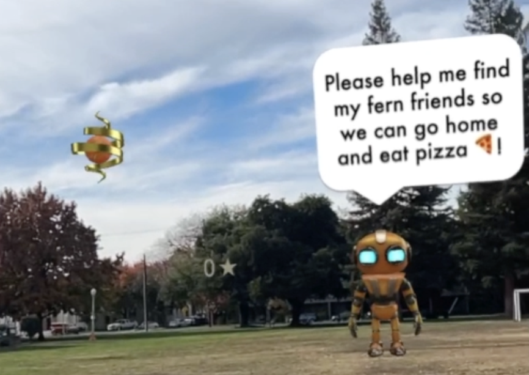

  

# Finding Fern
Help Roger Robot find all the Fern Friends! An AR RPG mini-game.

## Inspiration

The goal was to create an interactive mini RPG game where people can experience the beauty of the mix between AR and the outside world. I wanted to create a game that would be fun for all ages and would be easy to play.

AR user experience is still in it's infancy and hasn't found its way into everyday life. I wanted to create something that fit into a daily routine and would take approximately 3 minutes to play. The park seemed like a great place for an RPG mini-game. Most parks have enough space to walk around and explore, similar to what you would expect in an open world RPG game. 

To test the game, I went on my regular run at the park I deployed the scene and then played the game. It took me a little over 4 minutes to complete the game. I was also a lot of fun to play. I hope you enjoy it as much as I do.

## How it was Built

It was built using a tool Adobe Aero. It is currently in beta, but it is a great no-code tool for creating AR experiences. I used Adobe Aero to create the 3D models, animations, and interactions. I used Powerpoint to create the 2D assets and the UI. 

## Challenges

### Software Loading
Some models would disappear on load with the application is closed and reopened. I had to re-import the models and re-apply the animations.

### Debugging
There is a problem with the first fern. The tap condition doesn't always work. The fern must be tapped a few times before fully entering the rocketship. I tried to fix it by adding a second ontap condition, but it still doesn't work. Without a console there isn't a way to debug the problem.

### Thermal Considerations
The game contains 18 models and adobe aero also renders the locations geography. I am using a macbook air and found that I would have to allow my computer to cool down every few hours. If you are planning on using adobe aero, I recommend using a computer with a good cooling system. It would be nice if models could be rendered in a light weight mode for building on lightweight machines. I'd image this would also become important with larger projects as well.

## Accomplishments
* Creating an open world mini RPG game for AR.
* Creating a game that can be played in 4-10 minutes.

## What we learned

### Scene Building
The Adobe Aero scene creation is an incredible experience. After selecting the desired location for the game, the scene was generated with resonable accuracy to build the scene.

### Grouping
Grouping is important for aligning the reference frame of multiple objects. It is also helpful if you want multiple objects, to move together, rotate together, or scale together. Once all the reference frames (x,y,z axis) are aligned, aiming the objects at the camera is much easier. This was key for three aspects of the game: the speach bubbles, the score board, and the end game screen.

* The Speach Bubbles - The speach bubbles are grouped with their respective characters. This enables the speach bubble to move with the character. When a character speaks, the bubble and the character face the camera. If the user moves both continue to aim at the camera.

* The Score Board - The score board is grouped together and aimed at the camera. This enables the score board to move with the camera. When the user moves, the score board moves with the camera. This is where I learned about the grouping alignment. If you have an object that is symettric, and you inadvertantly rotated the object so the positive axis is facing away from the camera on start, the object will filp to the opposite side of the grouping.

* The End Game Screen - The end game screen is grouped together and aimed at the camera. The endgame screen function as a UI to launch the rocket and access more projects I've worked on.

### Workarounds
* UI in Adobe Aero - UI can be created with groupings of 3d or 2d objects. Groups can functions as a mini-scene within the game. It would also be possible to create 2d mini-games within the game.

* Dyamic Scoreboard - The scoreboard was greated with a group of 3D objects. To increment the score the total possible number of ferns collected needed to be added to the scene. As each fern is found numbers are hidden and shown to match the number of found ferns. It would be ideal to fetch models from a database and dynamically add them to the scene. I am new to adobe aero so am not sure if this is possible.

## What's next for Finding Fern
The software is fairly experimental, but I am excited to contiue to build on it. Overall, I had a wonderful experience with Adobe Aero. I am currently building an AR web app and this studio does make the process of creating AR experiences easier. I'm excited to see how the software develops.

If Finding Fern gains interest, I would like to begin replacing characters and further developing the UI within the game itself. It would be fun to release a new scene regularly with new character and new challenges. The challenge is there isn't a means to deploy the app. Each new scene would be a new link rather than contained within the application.

Another options would be to create the game in Unity, then it could be deployed on the app store and google play store and function as a fully contained game. 

## Built With
* Adode Aero Descktop Beta
* Microsoft Powerpoint
* Macbook Air (2020)

## Try it out
To try out the game, download the Adobe Aero app, click on the link, or scan the QR code below.

To begin tap the robot and the story will unfold!

  
  

Once you find all the fern friends you can launch the rocket and access more projects I've worked on.

  

Adobe Aero App Links:
* iOS: [https://apps.apple.com/us/app/adobe-aero/id1401748913](https://apps.apple.com/us/app/adobe-aero/id1401748913)
* Android: [https://play.google.com/store/apps/details?id=com.adobe.aero.android&hl=en&gl=US&pli=1](https://play.google.com/store/apps/details?id=com.adobe.aero.android&hl=en&gl=US&pli=1)

Game Link:
[https://adobeaero.app.link/8sYbZ7MhKDb](https://adobeaero.app.link/8sYbZ7MhKDb)

QR Code:

  

## Authors

* **[Joshua Howard](https://x.com/calculatingzero)** - *All Projects* - [calculatingzero](https://linktr.ee/calculatingzero)

